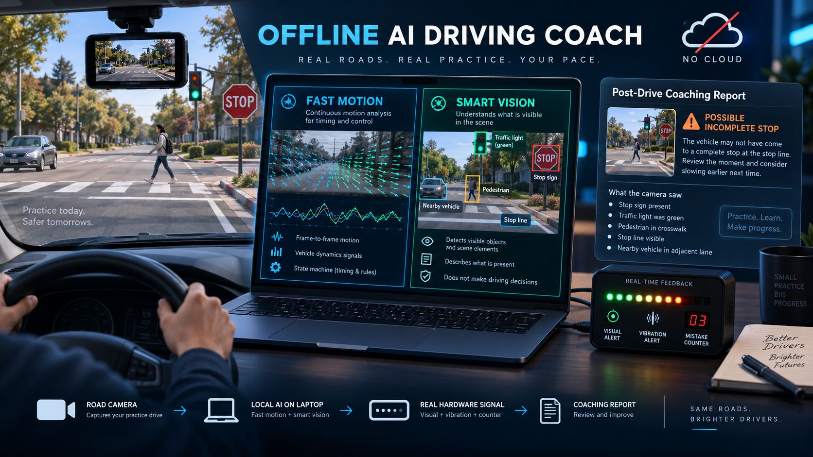

# AI Driving Test Coach



*Concept illustration, not a screenshot. The real review player is below.*

**An offline coach for practice drives before the DMV road test. Your dashcam
footage is understood by a vision model running on the Snapdragon X NPU, graded
by deterministic temporal logic, felt through an Arduino UNO Q, and written up
as an evidence-based report. The video never leaves the laptop.**

Built for the Qualcomm GenieX track of the AI Infra Summit Hackathon.

> This is a practice coach and post-drive review tool. It is **not** a DMV
> examiner, not an ADAS safety device, and not for use during a real road test.

---

## Screenshot

> **Placeholder.** Run `./run.sh --demo fail`, then screenshot the first
> viewport and save it as `docs/hero.png`. That shot — outcome banner, evidence
> overlay, "how the coach decided" chain — is the whole pitch in one image.

```

```

---

## The 30-second version

A learner drives with a phone on the windscreen. Afterwards:

1. **PyAV** decodes every frame locally. No OpenCV — it has no Windows ARM64 wheel.
2. A **fast layer** measures ego-motion on every frame with numpy. Microseconds.
   It answers one question: has the picture gone still?
3. A **smart layer** sends one frame every ~3s to **Qwen3-VL-4B on the NPU**
   through GenieX. It is asked only what is *visible* in that one frame — never
   "did the driver stop?", because it cannot see across time and would guess.
4. A **state machine** combines the two over time and decides what happened.
5. The **UNO Q** gives the signal you can feel: LED strip, 8×13 matrix, vibration.
6. A **report** comes out with a timestamp, a screenshot, the rule that fired,
   and a coaching tip for every finding.

The interesting part is step 4, and the reason is in the next section.

---

## Why the temporal logic is the product

**The stop sign leaves the frame before the car reaches the line.** On our real
clip the sign was visible 51–60s, gone by 63s, and the car stopped at 64–65s. So
`stop_sign == true` and `stopped == true` **never occur in the same frame**. A
detector that asks for both at once flags every correct stop as a violation.

So the approach window opens when a sign is confirmed and stays open for ten
seconds *after* the sign disappears. Three outcomes, not two:

| grade | meaning | counted as |
|---|---|---|
| **full stop** | stationary for at least 3s | nothing |
| **brief stop** | stationary, but under 3s | a coaching note, never an error |
| **possible incomplete stop** | no stationary window in the whole approach | a possible critical error |

A brief stop is legal in California — the law asks for a complete stop and puts
no number on it. The three-second target is ours, so it is advice, and it never
increments a strike.

**Two timestamps per finding, and they are not the same.** `detected_at` is when
we first had grounds to say anything; `decision_at` is when the outcome was
settled. On a failed approach those are ten seconds apart, and **nothing signals
the failure before `decision_at`** — not the LED, not the buzzer, not the page.
A coach that announces the mistake before the driver has had the chance to make
it is worthless.

---

## The model says yes too easily — and what fixed it

Our first prompt listed the fields as a bare true/false menu. Scored against 38
hand-labelled frames from our real clip it produced **22 clear false alarms**: a
close car on 7 frames of empty road, a red light on 6 frames with no signal
anywhere, a pedestrian on 5 frames with nobody in them. A menu of choices invites
the model to pick something.

Two fixes, both measured:

**1. A prompt that says what each field excludes** (`STRICT_PROMPT`).

| prompt | right | false alarms | missed | s/call |
|---|---|---|---|---|
| terse (original) | 118 | **22** | 0 | 3.06 |
| strict | 133 | **0** | 7 | 3.48 |
| strict + "name what you see first" | 130 | 3 | 7 | 4.54 |

*On the 38 labelled frames in `tools/labels/IMG_9830.json`, identical across
three repeat runs.* Making the model justify itself first was **worse** and 30%
slower — it invents evidence to match an answer it has already chosen.

**2. Two samples must agree** (`laptop/scene_filter.py`). A real sign, signal or
pedestrian lasts several seconds and appears in consecutive samples 3s apart; a
hallucination usually does not. Every soft field is reset unless a neighbour
backs it up, and the rejects are **shown on the page, struck through**.

Neither half is enough alone. On the old timeline, confirmation caught 7 of the
hallucinations but not the car-ahead claims at 45+48s and 81+84s, where the model
repeated the same mistake twice running. The prompt removes those at the source.

Reproduce it:

```bash
python tools/eval_scene_prompt.py
```

---

## Architecture

```
LAPTOP (Snapdragon X, Windows ARM64)                         UNO Q
────────────────────────────────────                    ──────────────
video ──► PyAV decode
           │
           ├─► ego_motion.py      every frame, numpy, µs
           │     "has the picture gone still?"
           │
           └─► scene_vision.py    every ~3s, Qwen3-VL-4B on the NPU
                 "what is visible in THIS frame?"  → JSON
                        │
                 scene_filter.py  drop anything one sample claimed alone
                        │
                 drive_review.py  ◄── the state machine and the rules
                        │            approaches · grades · events · level track
                        ▼
                 output/review.json   ← one source of truth
                   ├──► player.html   video, synchronised, with the evidence
                   ├──► report.html   printable, one card per finding
                   └──► serve_player.py ──MCP over USB/ADB──► mcp_server.py
                                                                   │
                                                          arduino_bridge.py
                                                        (hand-rolled MessagePack)
                                                                   │
                                                        Arduino Router socket
                                                                   │
                                                          alert_sketch.ino
                                                        matrix · Pixels · Vibro
```

The one rule that matters: **the page, the printout and the LED strip all read
`review.json` and nothing else.** They used to each re-interpret the raw samples,
which is exactly how they came to disagree.

---

## Why GenieX and Snapdragon matter here

Dashcam footage of a learner driver is about as private as video gets: their
face, their street, their mistakes, and everyone else on the road who never
agreed to be filmed. The obvious cloud version of this product is one a parent
should refuse to install.

- The whole pipeline runs on the laptop. The only network traffic is to
  `127.0.0.1:18181`. **Zero bytes of video leave the device.**
- `geniex serve -c npu` puts a 4B vision-language model on the NPU at
  **~3.4s per 640×480 frame, warm** — fast enough to sample a drive every 3s,
  which is what makes the temporal logic possible at all.
- W4A16 quantisation is what fits a 4B VLM in a laptop's power budget.
- The review page reports the compute unit as **requested**, never as verified.
  The OpenAI-compatible API does not say which unit served a request, so the
  page has nothing to read back, and a badge we cannot stand behind is worse
  than none.

**But the plugin answers the question itself.** Start the server with `-c cpu`
and it logs:

```
Warning: qairt plugin only supports NPU inference; ignoring device='cpu' and running on NPU
```

So there is no CPU number to get on this machine — and that refusal is better
evidence than a benchmark would have been. A backend that will not run anywhere
except the NPU, and says so in its own log, is the closest thing to proof
available here. `tools/benchmark_compute.py` reads that line, records it, and
declines to print a speedup between two labels that both ran on the same silicon:

```bash
python tools/benchmark_compute.py --compare
```

Measured warm on the NPU: **3.44s median over 5 calls**, first call 13.4s
including model load.

## Why the UNO Q matters here

A review page tells you what you did wrong ten minutes ago. A learner needs the
signal **while their hands are on the wheel** — and they cannot look at a screen.

The board earns its place by being two computers: the Linux side speaks MCP and
the Arduino Router Bridge, and the microcontroller does deterministic,
non-blocking physical output. Levels are told apart by intensity, not presence:

| level | meaning | strip | matrix | you feel |
|---|---|---|---|---|
| 0 | driving fine | green | calm bar | — |
| 1 | heads up | all amber, 1.2 Hz | **octagon** | one gentle tap |
| 2 | minor mistake | +1 red | the count, 2s | one firm pulse |
| 3 | critical | all flash red, 4 Hz | big X | three, building |

**The octagon, not the X, for a stop sign.** The X means a critical error. Using
it for merely *seeing* a sign would tell the room we flagged a violation that
never happened — the first thing a judge would catch.

**Level 2 is implemented but no check produces it.** A brief stop is legal and
must not be counted; following distance is experimental. `laptop/test_signals.py`
is how you see it. We would rather say that than invent a strike so the counter
moves on stage.

---

## What this build checks

| check | status | scored? |
|---|---|---|
| **Stop-sign approach** | **active** — sign confirmed across samples, graded against the motion track | **yes** |
| Red light for our lane | warning only — detected and shown live | no |
| Following distance | experimental — a subjective per-frame judgement, not a measured distance | no |
| Head checks, mirrors, signals | **unavailable** — a forward camera cannot see them | no |

A red-light *violation* needs a reliable stop-line crossing test. `stop_line_visible`
is the weakest field we have (it fired on pavement lettering beside a parking
structure), so the check stays a warning and says so. Honest scope beats a false
critical error on stage.

---

## Quick start

Everything is one command, from **Git Bash** on Windows:

```bash
./run.sh
```

That starts GenieX on the NPU if nothing is listening, analyses the video in the
project root, builds the player and the report, serves them on localhost and
opens the player in your browser. Ctrl-C stops the server — and returns the
board to level 0 if one is attached.

The page is always served rather than opened from disk. A `file://` page has no
origin to post level changes to, so the hardware could never work from one, and
Chrome and Edge refuse to play a video from `file://` often enough that it is
not worth the caveat. `--no-serve` gives you the old behaviour if you want it.

No footage to hand? Every outcome has a demo:

```bash
./run.sh --demo fail
```

```bash
./run.sh --demo pass --unoq
```

`--demo` uses a synthetic clip rendered by `tools/make_test_clip.py`, analysed
for real by the local model. It is labelled synthetic in an amber banner on
every page, because a rendered road is not a drive.

Other flags:

| flag | what it does |
|---|---|
| `./run.sh clips/drive2.mov` | a specific file |
| `--reuse` | skip the vision pass, just rebuild the player and report |
| `--unoq` | serve the page and drive the board over USB |
| `--every 5` | sample the model every 5s instead of 3 |
| `--compute cpu` | ask GenieX for a different compute unit |
| `--full-stop 2` | change how long a stop must last to count as full |
| `--calm` | stop the board flashing and exit — nothing else |
| `--no-serve` | open the page from disk instead of serving it |
| `--window-after 12` | how long after the sign leaves the frame to keep looking |

Run the tests — no model, no board, no video needed:

```bash
python -m pytest
```

---

## Full setup from a fresh clone

**Laptop** (Python 3.12 ARM64):

```bash
pip install -r laptop/requirements.txt
```

`fastmcp` is only needed to talk to the board, and on Windows ARM64 it needs a
wheel hint first — `cryptography` has no win-arm64 source build and pip resolves
to an older version:

```bash
pip install --only-binary :all: cryptography && pip install fastmcp
```

Check `--only-binary` before concluding any package is unavailable on this
laptop. It is the same trap OpenCV fails on, except OpenCV really has no wheel.

**GenieX** — pull the vision model once:

```bash
geniex pull qualcomm/Qwen3-VL-4B-Instruct:W4A16
```

Note the `qualcomm/` prefix and the `:W4A16` suffix; the API rejects the bare
name. The report's optional narrative model is separate and entirely optional:

```bash
geniex pull qualcomm/Qwen3-4B
```

**UNO Q** — see [`unoq/README.md`](unoq/README.md). Short version: flash
`alert_sketch.ino` with Arduino App Lab (install the **Modulino** library; do
*not* look for `Arduino_LED_Matrix`, it ships with the Zephyr core), plug both
Modulinos into the QWIIC chain, and `./run.sh --unoq` does the rest — it pushes
the board-side server, starts it, and opens the USB tunnel.

---

## Project structure

```
laptop/
  config.py          every shared default, and the settings that travel in review.json
  video_source.py    PyAV decode, rotation handling
  ego_motion.py      the fast layer — frame differencing over spatial gradient
  scene_vision.py    the smart layer — Qwen3-VL through GenieX, STRICT_PROMPT
  scene_filter.py    two-sample confirmation, and when a claim could be known
  drive_review.py    ★ the rules: approaches, grades, events, level track
  video_prep.py      playable copy, dense motion, evidence stills
  report.py          the deterministic report
  narrate.py         optional prose from a local text model, heavily fenced
  unoq_mcp.py        the board client, and seek-safe event replay
  calm_board.py      put the board back to level 0 — the "make it stop" button
tools/
  make_player.py     orchestrates a build: review.json + player.html + report.html
  serve_player.py    localhost server with byte ranges, and the hardware relay
  eval_scene_prompt.py   score a prompt change against hand-labelled frames
  benchmark_compute.py   time the vision call, and read the plugin's own verdict
  make_test_clip.py  render a synthetic clip with exact ground truth
  freeze_demo.py     record a real run so the demo survives GenieX being down
unoq/
  mcp_server.py      MCP server, Linux side of the board
  arduino_bridge.py  MessagePack-RPC in ~20 lines, no dependencies
  alert_sketch/      the sketch: matrix, Pixels, Vibro, nothing blocking
report/              the two HTML templates
tests/               117 tests, no GenieX and no board required
docs/                demo script, test plan, submission checklist
archive/             the superseded HTTP-over-Wi-Fi transport, and why
```

---

## Privacy and responsible use

- **Nothing is uploaded.** Video, frames, findings and report all stay on the
  laptop. The only network traffic is to `127.0.0.1`; the board is reached over
  a USB cable.
- **No accounts, no telemetry, no analytics.**
- **Never presented as a DMV result.** The page says "practice outcome" and
  every finding is reported as *possible*.
- **Footage consent.** Use your own recordings, or a dataset whose licence
  allows it. Do not break a traffic law to create demo footage — that is exactly
  why the synthetic clips exist.

## Limitations

- **No speed feed.** No CAN bus, no GPS. A very slow crawl cannot be told from a
  true standstill, so every stop finding is *possible*, and durations are worded
  as "about 1.1s at a standstill", never as a measured speed.
- **One command for the whole demo.** `./demo.sh` opens a console at
  `http://127.0.0.1:8080` with the recorded drives, the bad-driving simulations and
  the live camera on one page, board attached. Nothing to type in front of an audience.
- **Two modes, and they claim different things.** The default is post-drive
  review of a file: the analysis runs at **0.73× real time** (113.7s of video
  took 156.7s), and the board reacts at the exact timestamps as the video plays
  — real hardware, in real time, to decisions computed earlier.
  `./run.sh --live` reads the laptop camera instead and signals the board as you
  drive. It is genuinely live and **genuinely behind**: a confirmed warning
  arrives about **6.8s** after the event (measured), because one vision call
  costs ~3.5s and a second sample has to agree before we act. That delay is not
  a defect to tune out — dropping it means acting on a single frame, which is
  what produces hallucinated red lights. A stop-sign approach tolerates it, as
  the verdict is not due until ~10s after the sign is seen. A red light does
  not, so live mode shows red lights and never calls them a timely warning.
  Every review says which mode produced it, and `drive.source` is `live` or not.
- **The motion threshold is narrow.** 0.25 sits between a stopped car at 0.24 and
  a moving one at 0.31 on our real footage. Recalibrate on new footage with
  `python laptop/test_video.py <clip>` before trusting it.
- **Evaluation set is small.** 38 labelled frames from one clip. "Zero false
  alarms" means zero on those 38 frames, and nothing more.
- **One real clip.** IMG_9830 contains a genuine 1.07s stop and no violation.
  Every failure outcome shown is from synthetic footage, clearly labelled.

## Demo video

> **Placeholder** — link the backup screen recording here before submitting.

## Troubleshooting

| symptom | cause and fix |
|---|---|
| `Python was not found` from Git Bash | the Microsoft Store stub. `run.sh` works around it by actually running an import; call scripts through `run.sh` or use the full path under `%LOCALAPPDATA%\Programs\Python\Python312-arm64`. |
| The video will not play in the browser | Chrome and Edge refuse `.mov` even when the video inside is H.264. `make_player.py` rewraps it as MP4 by stream copy automatically. `run.sh` also serves the page over http rather than `file://`, which is the other half of this problem. |
| Frames arrive sideways | phone rotation flags are not applied on decode. Film in landscape, or pass `--rotate 90\|180\|270`. |
| `secure_mkdirs failed` on `adb push` | Git Bash rewrote `/home/arduino/...` into a Windows path. Prefix with `MSYS_NO_PATHCONV=1`. |
| Board connected but nothing moves | `mcu_ping` is the only call that proves the *sketch* is running — the others only prove the router took the bytes. Check the hardware panel on the page. |
| **Board keeps flashing and the player has no effect** | The sketch holds its last level forever — it cannot tell the laptop has gone. A `--demo fail` run ends on level 3 and stays there. Fix: `./run.sh --calm`, or the **Stop the board** button on the page. `./run.sh` now also calms an idle board at the start of any run that is not using it. |
| The LED matrix is blank | draw rate. Never call `matrix.draw()` straight from `loop()`; the scan never settles. See `unoq/README.md`. |
| `pip install fastmcp` fails | `pip install --only-binary :all: cryptography` first. |
| GenieX will not start | `./run.sh --demo fail` falls back to recorded scene labels and says so on the page. |

## Licence

No licence file yet — add one before making the repository public. Until then
all rights are reserved by default, which is probably not what you want for a
hackathon submission.
